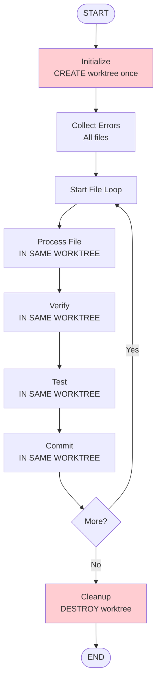

# Task 6 Refactoring Plan: Per-File Worktree Architecture

> **Status:** 📋 READY FOR IMPLEMENTATION  
> **Created:** 2025-10-08  
> **Purpose:** Refactor workflow to use one worktree per file (not per session)  
> **Estimated Time:** 6-8 hours

---

## 📊 Complete Workflow Visualization

### Detailed Mermaid Diagram - Complete Flow

```mermaid
graph TD
    START([🚀 START]) --> INIT[Initialize Session]
    
    INIT[📋 Initialize Session<br/>Create session ID<br/>Setup session state<br/>NO worktree creation] --> COLLECT
    
    COLLECT[🔍 Collect All Errors<br/>Location: MAIN workspace<br/>Run: ruff, mypy, etc<br/>Group by file<br/>Build file queue] --> CHECK_FILES{Any files<br/>with errors?}
    
    CHECK_FILES -->|No errors found| FINAL_CLEANUP
    CHECK_FILES -->|Files to process| CREATE_WT
    
    subgraph PER_FILE_CYCLE ["Per-File Processing Cycle (Repeats for Each File)"]
        CREATE_WT[🏗️ Create Worktree<br/>Location: .stomper/sandboxes/<br/>Name: session_filestem<br/>Branch: sbx/session_filestem<br/>Base: HEAD<br/>FRESH checkout] --> GEN_PROMPT
        
        GEN_PROMPT[📝 Generate Prompt<br/>Extract THIS file errors only<br/>Load error advice<br/>Apply adaptive strategy<br/>Read code from worktree<br/>Store in current_prompt] --> CALL_AGENT
        
        CALL_AGENT[🤖 Call AI Agent<br/>Location: IN worktree<br/>Scope: THIS file only<br/>Uses current_prompt<br/>Intelligent fallback<br/>Writes fix to worktree] --> VERIFY
        
        VERIFY[🔍 Verify Fixes<br/>Location: IN worktree<br/>Re-run quality tools<br/>Compare before/after<br/>Track fixed errors] --> FIXED{All errors<br/>fixed?}
        
        FIXED -->|Some remain<br/>attempts < max| RETRY
        FIXED -->|Max attempts| ERROR
        FIXED -->|All fixed| TEST_CHECK{Run tests<br/>enabled?}
        
        RETRY[🔄 Retry File<br/>Increment attempts<br/>Enhance prompt feedback<br/>SAME worktree] --> GEN_PROMPT
        
        TEST_CHECK -->|Yes| RUN_TESTS
        TEST_CHECK -->|No| EXTRACT
        
        RUN_TESTS[🧪 Run Test Suite<br/>Location: IN worktree<br/>Mode: Full suite default<br/>Validate no breaks] --> TEST_OK{Tests<br/>passed?}
        
        TEST_OK -->|Failed| ERROR
        TEST_OK -->|Passed| EXTRACT
        
        EXTRACT[📤 Extract Diff<br/>Location: FROM worktree<br/>Method: GitPython<br/>Command: git diff HEAD<br/>Store in current_diff] --> APPLY
        
        APPLY[🔀 Apply to Main<br/>Location: MAIN workspace<br/>Method: GitPython git apply<br/>LOCK: Parallel safety<br/>Apply current_diff] --> COMMIT
        
        COMMIT[💾 Commit in Main<br/>Location: MAIN workspace<br/>Method: GitPython<br/>Message: Conventional<br/>Stage & commit file] --> DESTROY
        
        DESTROY[🗑️ Destroy Worktree<br/>Remove worktree<br/>Delete branch<br/>IMMEDIATELY<br/>Clear sandbox_path] --> RECORD
        
        RECORD[✅ Record Success<br/>Add to successful_fixes<br/>Update ErrorMapper<br/>Clear current_prompt/diff] --> MORE{More files<br/>in queue?}
        
        ERROR[❌ Handle Error<br/>Log failure details<br/>Add to failed_fixes<br/>Record in ErrorMapper] --> DESTROY_ERR
        
        DESTROY_ERR[🗑️ Destroy on Error<br/>Cleanup failed worktree<br/>Clear state] --> CONTINUE{Continue<br/>with others?}
        
        CONTINUE -->|Yes, has more| MORE
        CONTINUE -->|No, abort| FINAL_CLEANUP
        
        MORE -->|Next file| CREATE_WT
        MORE -->|All done| FINAL_CLEANUP
    end
    
    FINAL_CLEANUP[🧹 Final Cleanup<br/>Save ErrorMapper learning<br/>Verify no worktrees left<br/>Generate summary<br/>Set final status] --> END([🎉 END])
    
    style START fill:#c8e6c9
    style END fill:#ffcdd2
    style CREATE_WT fill:#bbdefb
    style DESTROY fill:#ef9a9a
    style DESTROY_ERR fill:#ef9a9a
    style APPLY fill:#fff9c4
    style COMMIT fill:#c5e1a5
    style EXTRACT fill:#b2ebf2
    style CALL_AGENT fill:#ffe0b2
    style GEN_PROMPT fill:#e1bee7
    style RUN_TESTS fill:#b2dfdb
    style VERIFY fill:#f8bbd0
    style ERROR fill:#ffccbc
    style RETRY fill:#fff59d
    style RECORD fill:#dcedc8
    style FINAL_CLEANUP fill:#d1c4e9
```



### Detailed Text Flowchart - Step by Step

```
┌─────────────────────────────────────────────────────────────────────┐
│                    STOMPER WORKFLOW - DETAILED FLOW                  │
└─────────────────────────────────────────────────────────────────────┘

[START]
  │
  ├─► 1. INITIALIZE SESSION
  │      ├─ Create session ID: stomper-YYYYMMDD-HHMMSS
  │      ├─ Setup session state (files=[], current_file_index=0)
  │      ├─ Initialize components (AgentManager, PromptGenerator, etc)
  │      └─ NO WORKTREE CREATED YET ✅
  │
  ├─► 2. COLLECT ALL ERRORS
  │      ├─ Location: MAIN WORKSPACE (project_root)
  │      ├─ Run quality tools: ruff, mypy, pytest
  │      ├─ Parse JSON outputs
  │      ├─ Group errors by file path
  │      ├─ Create FileState for each file with errors
  │      ├─ Build queue: files = [FileState(auth.py), FileState(models.py), ...]
  │      └─ Set current_file_index = 0
  │
  ├─► 3. CHECK: Files to Process?
  │      ├─ If NO files → Jump to FINAL CLEANUP
  │      └─ If YES → Continue to file processing loop
  │
  │   ┌─────────────────────────────────────────────────────────────┐
  │   │         FILE PROCESSING LOOP (Repeat for Each File)          │
  │   └─────────────────────────────────────────────────────────────┘
  │   
  ├─► 4. CREATE WORKTREE (for current file)
  │      ├─ Get current file: files[current_file_index]
  │      ├─ Generate worktree ID: {session_id}_{file.stem}
  │      │    Example: stomper-20251008-153000_auth
  │      ├─ Create worktree using GitPython:
  │      │    repo.git.worktree("add", path, "-b", "sbx/{worktree_id}", "HEAD")
  │      ├─ Location: .stomper/sandboxes/{worktree_id}
  │      ├─ Store in state: sandbox_path = worktree_path
  │      └─ Log: "🏗️ Created worktree for auth.py"
  │
  ├─► 5. GENERATE PROMPT (for this file)
  │      ├─ Read file from worktree: worktree_path / file_path
  │      ├─ Extract ONLY this file's errors from FileState
  │      ├─ Convert ErrorInfo → QualityError objects
  │      ├─ Load error-specific advice from errors/ directory
  │      ├─ Apply adaptive strategy based on retry_count
  │      ├─ Render Jinja2 template (fix_prompt.j2)
  │      ├─ Store in state: current_prompt = rendered_prompt
  │      └─ Log: "📝 Generated prompt (1234 chars)"
  │
  ├─► 6. CALL AI AGENT (fix the file)
  │      ├─ Location: IN WORKTREE (sandbox_path)
  │      ├─ Increment: current_file.attempts += 1
  │      ├─ Prepare context: {file_path, error_count, ...}
  │      ├─ Call: agent.generate_fix_with_intelligent_fallback()
  │      │    ├─ Uses: current_prompt from previous step
  │      │    ├─ Uses: ErrorMapper for strategy selection
  │      │    ├─ Returns: fixed_code (complete file content)
  │      │    └─ Records: outcome in ErrorMapper
  │      ├─ Write fix: (worktree_path / file_path).write_text(fixed_code)
  │      └─ Log: "✅ Agent completed fix"
  │
  ├─► 7. VERIFY FIXES (in worktree)
  │      ├─ Location: IN WORKTREE
  │      ├─ Re-run quality tools on THIS file
  │      ├─ Compare: original errors vs new errors
  │      ├─ Calculate: fixed_errors = original - new
  │      ├─ Update: current_file.fixed_errors
  │      ├─ Update: current_file.errors (remaining)
  │      ├─ Update: state.total_errors_fixed += len(fixed)
  │      └─ Log: "Fixed 2 errors, 0 remaining"
  │
  ├─► 8. DECISION: Should Retry?
  │      ├─ If ALL FIXED → Continue to tests ✅
  │      ├─ If SOME REMAIN + attempts < max_retries:
  │      │    └─ Go to RETRY (step 6b)
  │      └─ If MAX RETRIES → Go to ERROR HANDLER
  │
  ├─► 6b. RETRY (if needed)
  │      ├─ Status: RETRYING
  │      ├─ Add feedback to prompt context
  │      ├─ KEEP SAME WORKTREE (don't recreate)
  │      └─ Loop back to: GENERATE PROMPT (step 5)
  │           ├─ Retry count incremented
  │           └─ Adaptive strategy escalates (NORMAL → DETAILED → VERBOSE)
  │
  ├─► 9. DECISION: Run Tests?
  │      ├─ If test_validation enabled → Continue to tests
  │      └─ If disabled → Skip to EXTRACT DIFF
  │
  ├─► 10. RUN TEST SUITE (in worktree)
  │       ├─ Location: IN WORKTREE
  │       ├─ Mode: Full test suite (default)
  │       │    Or: Quick mode (file-specific tests)
  │       ├─ Execute: pytest via QualityToolManager
  │       ├─ Check: Any test failures?
  │       ├─ If PASS → Continue ✅
  │       └─ If FAIL → Go to ERROR HANDLER ❌
  │
  ├─► 11. EXTRACT DIFF (from worktree)
  │       ├─ Location: FROM worktree
  │       ├─ Method: GitPython
  │       ├─ Code: worktree_repo = Repo(sandbox_path)
  │       │        diff = worktree_repo.git.diff("HEAD")
  │       ├─ Validation: Check diff is not empty
  │       ├─ Store: state["current_diff"] = diff_content
  │       └─ Log: "📤 Diff extracted (567 bytes)"
  │
  ├─► 12. APPLY TO MAIN WORKSPACE
  │       ├─ Location: MAIN WORKSPACE (project_root)
  │       ├─ 🔒 LOCK: Acquire diff_application_lock (parallel safety)
  │       ├─ Method: GitPython
  │       ├─ Code: main_repo = Repo(project_root)
  │       │        with tempfile: write diff to .patch file
  │       │        main_repo.git.apply(patch_file)
  │       ├─ Validation: Check apply succeeded
  │       ├─ 🔓 UNLOCK: Release diff_application_lock
  │       └─ Log: "✅ Patch applied to main workspace"
  │
  ├─► 13. COMMIT IN MAIN WORKSPACE
  │       ├─ Location: MAIN WORKSPACE
  │       ├─ Method: GitPython
  │       ├─ Generate: Conventional commit message
  │       │    Format: fix(quality): resolve N issues in file.py
  │       │            - E501: ...
  │       │            - F401: ...
  │       │            Fixed by: stomper vX.Y.Z
  │       ├─ Code: main_repo.index.add([file_path])
  │       │        main_repo.index.commit(commit_msg)
  │       ├─ Record: successful_fixes.append(file_path)
  │       └─ Log: "💾 Committed in main workspace"
  │
  ├─► 14. DESTROY WORKTREE (immediate cleanup)
  │       ├─ Extract: worktree_id from sandbox_path.name
  │       ├─ Method: GitPython via SandboxManager
  │       ├─ Code: sandbox_manager.cleanup_sandbox(worktree_id)
  │       │        ├─ git worktree remove --force
  │       │        └─ git branch -D sbx/{worktree_id}
  │       ├─ Clear: state["sandbox_path"] = None
  │       ├─ Clear: state["current_diff"] = None
  │       ├─ Clear: state["current_prompt"] = None
  │       └─ Log: "🗑️ Worktree destroyed"
  │       
  │       ⏱️ Worktree lifetime: ~10-30 seconds ✅
  │
  ├─► 15. RECORD SUCCESS
  │       ├─ Update ErrorMapper with success/failure
  │       ├─ Increment counters
  │       └─ Prepare for next file
  │
  ├─► 16. DECISION: More Files?
  │       ├─ If current_file_index + 1 < len(files):
  │       │    ├─ Increment current_file_index
  │       │    └─ Loop back to: CREATE WORKTREE (step 4)
  │       │         └─ Creates NEW worktree for next file ✅
  │       └─ If all files processed:
  │            └─ Continue to: FINAL CLEANUP
  │
  ├─► ERROR HANDLER (on any failure)
  │       ├─ Log error details
  │       ├─ Add to failed_fixes
  │       ├─ Update ErrorMapper (failure outcome)
  │       ├─ DESTROY WORKTREE (cleanup failed attempt)
  │       └─ Decision: Continue with other files?
  │            ├─ If YES → Increment index, loop to CREATE WORKTREE
  │            └─ If NO → Continue to FINAL CLEANUP
  │
  └─► FINAL CLEANUP
         ├─ Save ErrorMapper learning data to disk
         ├─ Verify no worktrees remaining (sanity check)
         ├─ Generate session summary:
         │    ├─ Files fixed: N
         │    ├─ Files failed: M
         │    └─ Total errors fixed: X
         ├─ Set final status: COMPLETED or FAILED
         └─ [END] 🎉

═══════════════════════════════════════════════════════════════════════

KEY POINTS:
✅ Worktree created FRESH for each file
✅ Worktree destroyed IMMEDIATELY after use
✅ Diff applied to MAIN workspace (not committed in worktree)
✅ Commits happen in MAIN workspace
✅ Lock ensures parallel safety for diff application
✅ Full test suite runs by default (configurable)
✅ GitPython used throughout (no subprocess)
```

---

## 📋 Complete Implementation Checklist

### ✅ Phase 1: State & Foundation (1-2 hours)

**File: `src/stomper/workflow/state.py`**

- [ ] **Task 1.1: Add new state fields**
  - [ ] Add `current_prompt: str` to StomperState
  - [ ] Add `current_diff: str | None` to StomperState
  - [ ] Add `current_worktree_id: str | None` to StomperState
  - [ ] Add `test_validation: str` to StomperState
  - [ ] Add `continue_on_error: bool` to StomperState

**File: `src/stomper/workflow/orchestrator.py`**

- [ ] **Task 1.2: Add helper methods**
  - [ ] Implement `_get_diff_lock()` → Returns asyncio.Lock
  - [ ] Add `_diff_application_lock` to __init__
  - [ ] Implement `_check_files_to_process()` → Returns "has_files" or "no_files"
  - [ ] Implement `_should_continue_after_error()` → Returns "continue" or "abort"

- [ ] **Task 1.3: Update imports**
  - [ ] Add `import asyncio`
  - [ ] Add `import tempfile`
  - [ ] Verify `from git import Repo` present

---

### ✅ Phase 2: New Workflow Nodes (2-3 hours)

**File: `src/stomper/workflow/orchestrator.py`**

- [ ] **Task 2.1: Implement create_worktree node**
  - [ ] Create `async def _create_worktree(state)` method
  - [ ] Generate worktree_id: `{session_id}_{file.stem}`
  - [ ] Call `sandbox_manager.create_sandbox(worktree_id, "HEAD")`
  - [ ] Store in `state["sandbox_path"]`
  - [ ] Store in `state["current_worktree_id"]`
  - [ ] Add logging with emoji
  - [ ] Handle direct mode (use_sandbox=False)

- [ ] **Task 2.2: Implement generate_prompt node**
  - [ ] Create `async def _generate_prompt(state)` method
  - [ ] Get current file from state
  - [ ] Read file content from worktree (or main if no sandbox)
  - [ ] Convert ErrorInfo → QualityError list
  - [ ] Call `prompt_generator.generate_prompt(errors, context, retry_count)`
  - [ ] Store in `state["current_prompt"]`
  - [ ] Add logging

- [ ] **Task 2.3: Implement call_agent node**
  - [ ] Create `async def _call_agent(state)` method
  - [ ] Get current_prompt from state
  - [ ] Increment current_file.attempts
  - [ ] Prepare error_context dict
  - [ ] Call `agent_manager.generate_fix_with_intelligent_fallback()`
  - [ ] Write fixed_code to file in worktree
  - [ ] Add comprehensive error handling
  - [ ] Add logging

- [ ] **Task 2.4: Implement extract_diff node**
  - [ ] Create `async def _extract_diff(state)` method
  - [ ] Get sandbox_path from state
  - [ ] Use GitPython: `Repo(sandbox_path).git.diff("HEAD")`
  - [ ] Validate diff is not empty
  - [ ] Store in `state["current_diff"]`
  - [ ] Handle no-sandbox mode
  - [ ] Add logging

- [ ] **Task 2.5: Implement apply_to_main node**
  - [ ] Create `async def _apply_to_main(state)` method
  - [ ] Get current_diff from state
  - [ ] Acquire `self._diff_application_lock` (async with)
  - [ ] Use GitPython: `Repo(project_root).git.apply(patch_file)`
  - [ ] Write diff to temp .patch file
  - [ ] Apply patch, clean up temp file
  - [ ] Release lock
  - [ ] Add comprehensive error handling
  - [ ] Add logging

- [ ] **Task 2.6: Implement commit_in_main node**
  - [ ] Create `async def _commit_in_main(state)` method
  - [ ] Generate conventional commit message
  - [ ] Use GitPython: `main_repo.index.add([file_path])`
  - [ ] Use GitPython: `main_repo.index.commit(message)`
  - [ ] Add to successful_fixes
  - [ ] Add error handling
  - [ ] Add logging

- [ ] **Task 2.7: Implement destroy_worktree node**
  - [ ] Create `async def _destroy_worktree(state)` method
  - [ ] Get current_worktree_id from state
  - [ ] Call `sandbox_manager.cleanup_sandbox(worktree_id)`
  - [ ] Clear `state["sandbox_path"] = None`
  - [ ] Clear `state["current_diff"] = None`
  - [ ] Clear `state["current_prompt"] = None`
  - [ ] Add error handling (log warning, continue)
  - [ ] Add logging

- [ ] **Task 2.8: Implement destroy_worktree_on_error node**
  - [ ] Create `async def _destroy_worktree_on_error(state)` method
  - [ ] Same as destroy_worktree but for error path
  - [ ] Ensure cleanup always happens
  - [ ] Add logging for error cleanup

---

### ✅ Phase 3: Update Existing Nodes (1-2 hours)

**File: `src/stomper/workflow/orchestrator.py`**

- [ ] **Task 3.1: Update _initialize_session**
  - [ ] REMOVE worktree creation code
  - [ ] Keep session_id generation
  - [ ] Set `sandbox_path = None` (created per file)
  - [ ] Update docstring
  - [ ] Verify logging

- [ ] **Task 3.2: Update _collect_all_errors**
  - [ ] FORCE working_dir = state["project_root"] (no sandbox fallback)
  - [ ] Remove `state.get("sandbox_path")` check
  - [ ] Update comment: "Run in MAIN workspace"
  - [ ] Verify file grouping logic
  - [ ] Update docstring

- [ ] **Task 3.3: Update _verify_file_fixes**
  - [ ] Keep as-is (already runs in worktree)
  - [ ] Verify it uses `state.get("sandbox_path")`
  - [ ] Update docstring if needed

- [ ] **Task 3.4: Update _run_test_suite**
  - [ ] Keep worktree execution logic
  - [ ] Add test_validation mode support
  - [ ] Implement: full, quick, final, none modes
  - [ ] Update docstring

- [ ] **Task 3.5: Update _cleanup_session**
  - [ ] REMOVE worktree cleanup code
  - [ ] Add sanity check (warn if sandbox_path still set)
  - [ ] Keep ErrorMapper save logic
  - [ ] Update summary logging
  - [ ] Update docstring

- [ ] **Task 3.6: Remove/refactor _process_current_file**
  - [ ] Logic now split into: generate_prompt + call_agent
  - [ ] Either remove or refactor into smaller pieces
  - [ ] Update any references

- [ ] **Task 3.7: Update _handle_processing_error**
  - [ ] Add error details logging
  - [ ] Record in ErrorMapper
  - [ ] Update to use destroy_worktree_on_error path

---

### ✅ Phase 4: Rebuild Graph Structure (1-2 hours)

**File: `src/stomper/workflow/orchestrator.py`**

- [ ] **Task 4.1: Update _build_graph node registration**
  - [ ] Add `create_worktree` node
  - [ ] Add `generate_prompt` node
  - [ ] Add `call_agent` node
  - [ ] Add `extract_diff` node
  - [ ] Add `apply_to_main` node
  - [ ] Add `commit_in_main` node
  - [ ] Add `destroy_worktree` node
  - [ ] Add `destroy_worktree_on_error` node
  - [ ] Update existing nodes
  - [ ] Remove old `process_file` node

- [ ] **Task 4.2: Update edge structure - main path**
  - [ ] `initialize` → `collect_errors`
  - [ ] `collect_errors` → CONDITIONAL(`check_files_to_process`)
  - [ ] Conditional routes: `has_files` → `create_worktree`, `no_files` → `cleanup`

- [ ] **Task 4.3: Update edge structure - per-file chain**
  - [ ] `create_worktree` → `generate_prompt`
  - [ ] `generate_prompt` → `call_agent`
  - [ ] `call_agent` → `verify_fixes`
  - [ ] `verify_fixes` → CONDITIONAL(`should_retry_fixes`)
  - [ ] Conditional routes: `retry` → `generate_prompt`, `success` → test check, `abort` → `handle_error`

- [ ] **Task 4.4: Update edge structure - test chain**
  - [ ] Test check CONDITIONAL: enabled → `run_tests`, disabled → `extract_diff`
  - [ ] `run_tests` → CONDITIONAL(`check_test_results`)
  - [ ] Conditional routes: `pass` → `extract_diff`, `fail` → `handle_error`

- [ ] **Task 4.5: Update edge structure - diff application chain**
  - [ ] `extract_diff` → `apply_to_main`
  - [ ] `apply_to_main` → `commit_in_main`
  - [ ] `commit_in_main` → `destroy_worktree`
  - [ ] `destroy_worktree` → CONDITIONAL(`check_more_files`)
  - [ ] Conditional routes: `next` → `create_worktree`, `done` → `cleanup`

- [ ] **Task 4.6: Update edge structure - error path**
  - [ ] `handle_error` → `destroy_worktree_on_error`
  - [ ] `destroy_worktree_on_error` → CONDITIONAL(`should_continue_after_error`)
  - [ ] Conditional routes: `continue` → check more files, `abort` → `cleanup`
  - [ ] `cleanup` → `END`

- [ ] **Task 4.7: Update _should_retry_fixes conditional**
  - [ ] Change retry route: `retry` → `generate_prompt` (not `retry_file`)
  - [ ] Keep other routes: `success`, `abort`

- [ ] **Task 4.8: Remove old edges**
  - [ ] Remove `process_file` related edges
  - [ ] Remove `retry_file` → `process_file` edge
  - [ ] Clean up any orphaned edge references

---

### ✅ Phase 5: Configuration Updates (30 min)

**File: `src/stomper/config/models.py`**

- [ ] **Task 5.1: Update WorkflowConfig**
  - [ ] Add `test_validation: Literal["full", "quick", "final", "none"] = "full"`
  - [ ] Add `files_per_worktree: int = Field(default=1, ge=1)`
  - [ ] Add `continue_on_error: bool = True`
  - [ ] Update docstrings

**File: `src/stomper/workflow/state.py`**

- [ ] **Task 5.2: Add TestValidation enum**
  - [ ] Create `TestValidation(str, Enum)` class
  - [ ] Add: FULL, QUICK, FINAL, NONE values
  - [ ] Add docstrings

---

### ✅ Phase 6: Testing Updates (2-3 hours)

**File: `tests/e2e/test_workflow_integration.py`**

- [ ] **Task 6.1: Update existing tests**
  - [ ] Update `test_full_workflow_success` for new flow
  - [ ] Update `test_workflow_with_retry` for new flow
  - [ ] Update `test_workflow_test_validation` for new flow
  - [ ] Update `test_workflow_git_isolation` for per-file worktrees
  - [ ] Update `test_workflow_adaptive_learning` for new flow
  - [ ] Update `test_workflow_no_errors_found` for new flow

- [ ] **Task 6.2: Add new tests**
  - [ ] Add `test_worktree_per_file_lifecycle` - Verify one worktree per file
  - [ ] Add `test_diff_extraction_gitpython` - Verify GitPython usage
  - [ ] Add `test_diff_application_to_main` - Verify main workspace updates
  - [ ] Add `test_commit_in_main_workspace` - Verify commits in main
  - [ ] Add `test_worktree_immediate_destruction` - Verify cleanup timing
  - [ ] Add `test_parallel_diff_lock` - Verify lock prevents races

- [ ] **Task 6.3: Update test utilities**
  - [ ] Update MockAIAgent if needed
  - [ ] Add helpers for tracking worktree lifecycle
  - [ ] Add helpers for verifying git operations

---

### ✅ Phase 7: Documentation Updates (1 hour)

**File: Various documentation files**

- [ ] **Task 7.1: Update task-6-IMPLEMENTATION-COMPLETE.md**
  - [ ] Update mermaid diagram to show per-file worktrees
  - [ ] Update architecture description
  - [ ] Update node descriptions

- [ ] **Task 7.2: Update task-6-FINAL-REVIEW.md**
  - [ ] Update workflow description
  - [ ] Update verification points

- [ ] **Task 7.3: Create refactoring summary**
  - [ ] Document what changed
  - [ ] Document why it changed
  - [ ] Document migration notes

---

### ✅ Phase 8: Verification & Testing (1-2 hours)

**Testing suite verification**

- [ ] **Task 8.1: Run unit tests**
  - [ ] Run: `uv run pytest tests/unit/ -v`
  - [ ] Verify: 267+ tests pass
  - [ ] Fix any broken tests
  - [ ] Verify: 0 linting errors

- [ ] **Task 8.2: Run E2E tests**
  - [ ] Run: `uv run pytest tests/e2e/test_workflow_integration.py -k asyncio -v`
  - [ ] Verify: All workflow tests pass
  - [ ] Add any missing edge case tests
  - [ ] Verify: New lifecycle tests pass

- [ ] **Task 8.3: Manual verification**
  - [ ] Create test project with 2-3 files with errors
  - [ ] Run workflow manually
  - [ ] Verify: Separate worktree for each file
  - [ ] Verify: Worktrees destroyed immediately
  - [ ] Verify: Diffs applied to main workspace
  - [ ] Verify: Commits in main workspace
  - [ ] Verify: No worktrees remain after session

- [ ] **Task 8.4: Linting & type checking**
  - [ ] Run: `uv run ruff check src/stomper/workflow/`
  - [ ] Run: `uv run mypy src/stomper/workflow/`
  - [ ] Fix any issues
  - [ ] Verify: 0 errors

---

## 🎯 Overview

### What Needs to Change

The current implementation creates **one worktree for the entire session** and processes all files within it. 

**Your actual design:** Create **one worktree per file**, process it completely, apply diff to main workspace, then destroy the worktree immediately.

### Why This Is Better

1. ✅ **True isolation** - Each file gets fresh environment
2. ✅ **Parallel-ready** - Can run multiple worktrees simultaneously
3. ✅ **Faster cleanup** - Worktree destroyed immediately after use
4. ✅ **Smaller diffs** - Each diff is just one file's changes
5. ✅ **Better debugging** - Know exactly which file caused issues
6. ✅ **Atomic operations** - Apply/commit/destroy as one unit

---

## 📊 Current vs. Target Architecture

### Current Implementation (INCORRECT)



**Problem:** All files processed in ONE worktree! ❌

---

### Target Implementation (CORRECT - Your Design)

```mermaid
flowchart TD
    START([START]) --> init["📋 Initialize Session<br/>- Create session ID<br/>- NO worktree yet"]
    
    init --> collect["🔍 Collect Errors<br/>- Run quality tools in MAIN workspace<br/>- Group errors by file<br/>- Create file queue"]
    
    collect --> check_files{Files with<br/>errors?}
    check_files -->|No| final_cleanup
    check_files -->|Yes| create_wt
    
    create_wt["🏗️ Create Worktree<br/>- For CURRENT file only<br/>- Branch: sbx/session_file<br/>- Base: HEAD<br/>- FRESH checkout"]
    
    create_wt --> gen_prompt["📝 Generate Prompt<br/>- Extract THIS file's errors only<br/>- Load error advice<br/>- Adaptive strategy<br/>- File-specific context"]
    
    gen_prompt --> call_agent["🤖 Call Agent<br/>- In worktree<br/>- Fix THIS file only<br/>- Agent returns control"]
    
    call_agent --> verify["🔍 Verify Fixes<br/>- Re-run quality tools<br/>- In worktree<br/>- On THIS file"]
    
    verify --> fixed{All<br/>fixed?}
    
    fixed -->|No, retry < max| retry["🔄 Retry<br/>- Same worktree<br/>- Enhanced prompt"]
    retry --> gen_prompt
    
    fixed -->|No, max retries| error_handler
    fixed -->|Yes| run_tests
    
    run_tests["🧪 Run Tests<br/>- FULL test suite<br/>- In worktree<br/>- Ensure nothing broke"]
    
    run_tests --> tests_ok{Tests<br/>passed?}
    
    tests_ok -->|No| error_handler
    tests_ok -->|Yes| extract
    
    extract["📤 Extract Diff<br/>- git diff HEAD<br/>- In worktree<br/>- Using GitPython"]
    
    extract --> apply["🔀 Apply to Main<br/>- LOCK for parallel safety<br/>- git apply patch<br/>- In MAIN workspace<br/>- Using GitPython"]
    
    apply --> commit_main["💾 Commit in Main<br/>- Conventional message<br/>- In MAIN workspace<br/>- Using GitPython"]
    
    commit_main --> destroy["🗑️ Destroy Worktree<br/>- git worktree remove<br/>- git branch -D<br/>- IMMEDIATELY<br/>- Using GitPython"]
    
    destroy --> record_success["✅ Record Success<br/>- Add to successful_fixes<br/>- Update ErrorMapper"]
    
    record_success --> more{More<br/>files?}
    
    more -->|Yes| create_wt
    more -->|No| final_cleanup
    
    error_handler["❌ Handle Error<br/>- Record failure<br/>- Destroy worktree<br/>- Continue or abort?"]
    
    error_handler --> destroy_error["🗑️ Destroy Worktree<br/>- Clean up failed attempt"]
    
    destroy_error --> continue{Continue<br/>others?}
    
    continue -->|Yes| more
    continue -->|No| final_cleanup
    
    final_cleanup["🧹 Final Cleanup<br/>- Save ErrorMapper data<br/>- Generate summary<br/>- NO worktrees left!"]
    
    final_cleanup --> END([END])
    
    style create_wt fill:#e3f2fd
    style destroy fill:#ffcdd2
    style destroy_error fill:#ffcdd2
    style apply fill:#fff3e0
    style commit_main fill:#e8f5e9
```



**Key Difference:** Worktree lifecycle is **per file**, not per session! ✅

---

## 🔄 Detailed Flow Comparison

### Current Flow (Session-Level Worktree)

```
Session Start
    ↓
Create ONE worktree
    ↓
┌─────────────────────┐
│ Process auth.py     │ ← In same worktree
│ Process models.py   │ ← In same worktree
│ Process utils.py    │ ← In same worktree
└─────────────────────┘
    ↓
Destroy ONE worktree
    ↓
Session End
```

**Timeline:** One long-lived worktree (minutes)

---

### Target Flow (File-Level Worktree)

```
Session Start
    ↓
Collect all errors (in main workspace)
    ↓
┌──────────────────────────────────┐
│ Create worktree_auth             │
│   ↓                               │
│ Fix auth.py                       │
│   ↓                               │
│ Verify in worktree_auth           │
│   ↓                               │
│ Test in worktree_auth             │
│   ↓                               │
│ Extract diff from worktree_auth   │
│   ↓                               │
│ Apply diff to MAIN workspace      │
│   ↓                               │
│ Commit in MAIN workspace          │
│   ↓                               │
│ Destroy worktree_auth             │ ← Immediate cleanup!
└──────────────────────────────────┘
    ↓
┌──────────────────────────────────┐
│ Create worktree_models           │ ← NEW worktree!
│   ↓                               │
│ Fix models.py                     │
│   ↓                               │
│ Verify in worktree_models         │
│   ↓                               │
│ Test in worktree_models           │
│   ↓                               │
│ Extract diff from worktree_models │
│   ↓                               │
│ Apply diff to MAIN workspace      │
│   ↓                               │
│ Commit in MAIN workspace          │
│   ↓                               │
│ Destroy worktree_models           │ ← Immediate cleanup!
└──────────────────────────────────┘
    ↓
Session End (no worktrees left!)
```

**Timeline:** Multiple short-lived worktrees (~30 sec each)

---

## 📝 Required Changes

### Change 1: Split collect_errors Node

**Current:**
```python
async def _collect_all_errors(self, state: StomperState):
    # Runs in worktree (WRONG!)
    working_dir = state.get("sandbox_path") or state["project_root"]
```

**Target:**
```python
async def _collect_all_errors(self, state: StomperState):
    # ALWAYS runs in main workspace (no worktree yet!)
    working_dir = state["project_root"]
    
    # Collect all errors
    all_errors = self.quality_manager.run_tools(...)
    
    # Group by file
    files_with_errors = self._group_errors_by_file(all_errors)
    
    # Create file queue
    state["files"] = files_with_errors
    state["current_file_index"] = 0
    
    return state
```

---

### Change 2: Remove Worktree from Initialize

**Current:**
```python
async def _initialize_session(self, state: StomperState):
    # Creates worktree (WRONG!)
    if self.use_sandbox:
        sandbox_path = self.sandbox_manager.create_sandbox(session_id)
```

**Target:**
```python
async def _initialize_session(self, state: StomperState):
    session_id = f"stomper-{datetime.now().strftime('%Y%m%d-%H%M%S')}"
    
    # NO worktree creation!
    state.update({
        "session_id": session_id,
        "sandbox_path": None,  # Will be created per file
        "status": ProcessingStatus.IN_PROGRESS,
    })
    
    return state
```

---

### Change 3: Add create_worktree Node

**New Node:**
```python
async def _create_worktree(self, state: StomperState) -> StomperState:
    """Create worktree for current file."""
    current_file = state["files"][state["current_file_index"]]
    session_id = state["session_id"]
    
    # Create unique worktree for THIS file
    file_stem = current_file.file_path.stem
    worktree_id = f"{session_id}_{file_stem}"
    
    logger.info(f"🏗️ Creating worktree for {current_file.file_path}")
    
    if self.use_sandbox:
        # Create worktree using GitPython
        sandbox_path = self.sandbox_manager.create_sandbox(
            session_id=worktree_id,
            base_branch="HEAD"
        )
        state["sandbox_path"] = sandbox_path
        logger.info(f"✅ Worktree created: {sandbox_path}")
    else:
        state["sandbox_path"] = None
        logger.info("⚠️ Running in direct mode (no sandbox)")
    
    return state
```

---

### Change 4: Add generate_prompt Node

**New Node:**
```python
async def _generate_prompt(self, state: StomperState) -> StomperState:
    """Generate AI prompt for current file."""
    current_file = state["files"][state["current_file_index"]]
    working_dir = state.get("sandbox_path") or state["project_root"]
    
    logger.info(f"📝 Generating prompt for {current_file.file_path}")
    
    # Read file content from worktree
    file_path = working_dir / current_file.file_path
    code_context = file_path.read_text()
    
    # Convert ErrorInfo to QualityError
    from stomper.quality.base import QualityError
    quality_errors = [
        QualityError(
            tool=err.tool,
            file=err.file_path,
            line=err.line_number,
            column=err.column or 0,
            code=err.code,
            message=err.message,
            severity=err.severity,
            auto_fixable=err.auto_fixable,
        )
        for err in current_file.errors
    ]
    
    # Generate prompt with adaptive strategy
    prompt = state["prompt_generator"].generate_prompt(
        errors=quality_errors,
        code_context=code_context,
        retry_count=current_file.attempts,
    )
    
    # Store prompt in state for agent node
    state["current_prompt"] = prompt
    
    logger.debug(f"Generated prompt ({len(prompt)} chars)")
    
    return state
```

---

### Change 5: Split process_file into call_agent Node

**Current (Too much):**
```python
async def _process_current_file(self, state: StomperState):
    # Reads file
    # Generates prompt  
    # Calls agent
    # Applies fix
    # ALL IN ONE!
```

**Target:**
```python
async def _call_agent(self, state: StomperState) -> StomperState:
    """Call AI agent to fix current file."""
    current_file = state["files"][state["current_file_index"]]
    working_dir = state.get("sandbox_path") or state["project_root"]
    
    logger.info(f"🤖 Calling agent to fix {current_file.file_path}")
    
    current_file.attempts += 1
    
    try:
        # Prepare context for agent
        error_context = {
            "file_path": str(current_file.file_path),
            "error_count": len(current_file.errors),
        }
        
        code_context = (working_dir / current_file.file_path).read_text()
        
        # Call agent with intelligent fallback
        fixed_code = state["agent_manager"].generate_fix_with_intelligent_fallback(
            primary_agent_name="cursor-cli",
            error=current_file.errors[0],  # Primary error (QualityError)
            error_context=error_context,
            code_context=code_context,
            prompt=state["current_prompt"],  # From previous node
            max_retries=1,
        )
        
        # Apply fix in worktree
        file_path = working_dir / current_file.file_path
        file_path.write_text(fixed_code)
        
        logger.info(f"✅ Agent completed fix for {current_file.file_path}")
        
    except Exception as e:
        logger.error(f"❌ Agent failed: {e}")
        current_file.last_error = str(e)
        raise  # Let error handler deal with it
    
    return state
```

---

### Change 6: Add extract_diff Node

**New Node:**
```python
async def _extract_diff(self, state: StomperState) -> StomperState:
    """Extract diff from worktree."""
    current_file = state["files"][state["current_file_index"]]
    sandbox_path = state.get("sandbox_path")
    
    if not sandbox_path:
        logger.info("No sandbox - skipping diff extraction")
        state["current_diff"] = None
        return state
    
    logger.info(f"📤 Extracting diff for {current_file.file_path}")
    
    try:
        # Use GitPython to get diff
        from git import Repo
        
        worktree_repo = Repo(sandbox_path)
        diff_content = worktree_repo.git.diff("HEAD")
        
        if not diff_content:
            logger.warning("No changes detected in worktree")
            state["current_diff"] = None
        else:
            state["current_diff"] = diff_content
            logger.info(f"✅ Diff extracted ({len(diff_content)} bytes)")
        
    except Exception as e:
        logger.error(f"❌ Failed to extract diff: {e}")
        raise
    
    return state
```

---

### Change 7: Add apply_to_main Node

**New Node with Parallel Safety:**
```python
async def _apply_to_main(self, state: StomperState) -> StomperState:
    """Apply diff to main workspace with parallel safety lock."""
    current_file = state["files"][state["current_file_index"]]
    diff_content = state.get("current_diff")
    
    if not diff_content:
        logger.info("No diff to apply")
        return state
    
    logger.info(f"🔀 Applying diff to main workspace for {current_file.file_path}")
    
    # Use lock for parallel safety (Phase 2)
    async with self._get_diff_lock():
        try:
            from git import Repo
            import tempfile
            
            main_repo = Repo(self.project_root)
            
            # Write diff to temp file
            with tempfile.NamedTemporaryFile(mode='w', suffix='.patch', delete=False) as f:
                f.write(diff_content)
                patch_file = f.name
            
            try:
                # Apply patch using GitPython
                main_repo.git.apply(patch_file)
                logger.info(f"✅ Patch applied to main workspace")
                
            finally:
                # Clean up temp file
                Path(patch_file).unlink()
            
        except Exception as e:
            logger.error(f"❌ Failed to apply patch: {e}")
            raise
    
    return state

def _get_diff_lock(self):
    """Get lock for diff application (creates if needed)."""
    if not hasattr(self, '_diff_application_lock'):
        import asyncio
        self._diff_application_lock = asyncio.Lock()
    return self._diff_application_lock
```

---

### Change 8: Add commit_in_main Node

**New Node:**
```python
async def _commit_in_main(self, state: StomperState) -> StomperState:
    """Commit changes in main workspace."""
    current_file = state["files"][state["current_file_index"]]
    
    logger.info(f"💾 Committing changes in main workspace for {current_file.file_path}")
    
    try:
        from git import Repo
        
        main_repo = Repo(self.project_root)
        
        # Generate conventional commit message
        error_codes = [e.code for e in current_file.fixed_errors]
        commit_msg = (
            f"fix(quality): resolve {len(error_codes)} issues in {current_file.file_path.name}\n\n"
            + "\n".join(f"- {code}" for code in error_codes)
            + f"\n\nFixed by: stomper v{self._get_version()}"
        )
        
        # Stage and commit using GitPython
        main_repo.index.add([str(current_file.file_path)])
        main_repo.index.commit(commit_msg)
        
        logger.info(f"✅ Committed in main workspace: {current_file.file_path}")
        
        # Record success
        state["successful_fixes"].append(str(current_file.file_path))
        
    except Exception as e:
        logger.error(f"❌ Failed to commit: {e}")
        raise
    
    return state
```

---

### Change 9: Add destroy_worktree Node

**New Node:**
```python
async def _destroy_worktree(self, state: StomperState) -> StomperState:
    """Destroy worktree for current file."""
    sandbox_path = state.get("sandbox_path")
    
    if not sandbox_path:
        logger.debug("No worktree to destroy")
        return state
    
    current_file = state["files"][state["current_file_index"]]
    logger.info(f"🗑️ Destroying worktree for {current_file.file_path}")
    
    try:
        # Extract session ID from sandbox_path
        # Format: .stomper/sandboxes/{session_id}_{file_stem}
        session_id = sandbox_path.name
        
        # Cleanup using GitPython (via SandboxManager)
        self.sandbox_manager.cleanup_sandbox(session_id)
        
        # Clear from state
        state["sandbox_path"] = None
        
        logger.info(f"✅ Worktree destroyed")
        
    except Exception as e:
        logger.warning(f"⚠️ Failed to destroy worktree: {e}")
        # Continue anyway - don't fail the workflow
    
    return state
```

---

### Change 10: Update Cleanup Node

**Current:**
```python
async def _cleanup_session(self, state: StomperState):
    # Destroys worktree (WRONG - should already be gone!)
    if self.sandbox_manager and state.get("sandbox_path"):
        self.sandbox_manager.cleanup_sandbox(state["session_id"])
```

**Target:**
```python
async def _cleanup_session(self, state: StomperState) -> StomperState:
    """Clean up session resources."""
    logger.info("🧹 Final session cleanup")
    
    # Save mapper learning data
    if state.get("mapper"):
        try:
            state["mapper"].save()
            logger.info("✅ Saved learning data")
        except Exception as e:
            logger.warning(f"Failed to save mapper data: {e}")
    
    # Verify no worktrees left (sanity check)
    if state.get("sandbox_path"):
        logger.warning("⚠️ Worktree still exists - this shouldn't happen!")
        # Try to clean it up anyway
        try:
            self.sandbox_manager.cleanup_sandbox(state["sandbox_path"].name)
        except Exception:
            pass
    
    # Final status
    if state["status"] != ProcessingStatus.FAILED:
        state["status"] = ProcessingStatus.COMPLETED
    
    # Generate summary
    logger.info(
        f"🎉 Session complete:\n"
        f"  - Files fixed: {len(state['successful_fixes'])}\n"
        f"  - Files failed: {len(state['failed_fixes'])}\n"
        f"  - Total errors fixed: {state['total_errors_fixed']}"
    )
    
    return state
```

---

### Change 11: Update Graph Structure

**Current edges:**
```python
workflow.add_edge("initialize", "collect_errors")
workflow.add_edge("collect_errors", "process_file")
workflow.add_edge("process_file", "verify_fixes")
```

**Target edges:**
```python
# Initialize → Collect (no worktree yet)
workflow.add_edge("initialize", "collect_errors")

# Collect → Check if files exist
workflow.add_conditional_edges(
    "collect_errors",
    self._check_files_to_process,
    {
        "has_files": "create_worktree",
        "no_files": "cleanup",
    }
)

# Per-File Processing Chain
workflow.add_edge("create_worktree", "generate_prompt")
workflow.add_edge("generate_prompt", "call_agent")
workflow.add_edge("call_agent", "verify_fixes")

# Verify → Retry or Continue
workflow.add_conditional_edges(
    "verify_fixes",
    self._should_retry_fixes,
    {
        "retry": "generate_prompt",  # Re-generate with feedback
        "success": "run_tests",
        "abort": "handle_error",
    }
)

# Tests → Extract Diff or Error
workflow.add_conditional_edges(
    "run_tests",
    self._check_test_results,
    {
        "pass": "extract_diff",
        "fail": "handle_error",
    }
)

# Diff Application Chain (all in main workspace)
workflow.add_edge("extract_diff", "apply_to_main")
workflow.add_edge("apply_to_main", "commit_in_main")
workflow.add_edge("commit_in_main", "destroy_worktree")

# After destroying worktree → Check for more files
workflow.add_conditional_edges(
    "destroy_worktree",
    self._check_more_files,
    {
        "next": "create_worktree",  # Create NEW worktree for next file!
        "done": "cleanup",
    }
)

# Error handling also destroys worktree
workflow.add_edge("handle_error", "destroy_worktree_on_error")
workflow.add_conditional_edges(
    "destroy_worktree_on_error",
    self._should_continue_after_error,
    {
        "continue": "next_file",  # Will create new worktree
        "abort": "cleanup",
    }
)
```

---

## 🗂️ File-by-File Implementation Plan

### Step 1: Update state.py (Add New Fields)

**Add to StomperState:**
```python
class StomperState(TypedDict, total=False):
    # Existing fields...
    
    # New fields for per-file processing
    current_prompt: str  # Generated prompt for current file
    current_diff: str | None  # Extracted diff for current file
    current_worktree_id: str | None  # ID of current worktree
```

---

### Step 2: Update orchestrator.py (Add New Nodes)

**Add these methods to StomperWorkflow:**

1. `_create_worktree()` - Create worktree for file
2. `_generate_prompt()` - Generate file-specific prompt
3. `_call_agent()` - Call agent (split from process_file)
4. `_extract_diff()` - Extract diff using GitPython
5. `_apply_to_main()` - Apply patch to main workspace
6. `_commit_in_main()` - Commit in main workspace
7. `_destroy_worktree()` - Destroy worktree immediately
8. `_destroy_worktree_on_error()` - Cleanup on error path
9. `_check_files_to_process()` - Check if any files to process
10. `_should_continue_after_error()` - Decide if continue after error
11. `_get_diff_lock()` - Get asyncio lock for parallel safety

**Remove/refactor:**
- `_process_current_file()` - Split into call_agent + others

---

### Step 3: Update _build_graph() (New Flow)

**Complete new graph structure:**
```python
def _build_graph(self) -> Any:
    """Build LangGraph state machine."""
    workflow = StateGraph(StomperState)
    
    # Add all nodes
    workflow.add_node("initialize", self._initialize_session)
    workflow.add_node("collect_errors", self._collect_all_errors)
    workflow.add_node("create_worktree", self._create_worktree)
    workflow.add_node("generate_prompt", self._generate_prompt)
    workflow.add_node("call_agent", self._call_agent)
    workflow.add_node("verify_fixes", self._verify_file_fixes)
    workflow.add_node("run_tests", self._run_test_suite)
    workflow.add_node("extract_diff", self._extract_diff)
    workflow.add_node("apply_to_main", self._apply_to_main)
    workflow.add_node("commit_in_main", self._commit_in_main)
    workflow.add_node("destroy_worktree", self._destroy_worktree)
    workflow.add_node("next_file", self._move_to_next_file)
    workflow.add_node("cleanup", self._cleanup_session)
    workflow.add_node("handle_error", self._handle_processing_error)
    workflow.add_node("destroy_worktree_on_error", self._destroy_worktree)
    
    # Set entry point
    workflow.set_entry_point("initialize")
    
    # Build edges (see Change 11 above for complete structure)
    # ... (detailed in implementation section)
    
    return workflow.compile()
```

---

### Step 4: Use GitPython Everywhere

**Replace subprocess calls with GitPython:**

**Before:**
```python
subprocess.run(["git", "diff", "HEAD"], cwd=worktree_path, ...)
subprocess.run(["git", "apply", patch_file], cwd=main_workspace, ...)
subprocess.run(["git", "commit", "-m", msg], cwd=main_workspace, ...)
```

**After:**
```python
from git import Repo

# Get diff
worktree_repo = Repo(worktree_path)
diff = worktree_repo.git.diff("HEAD")

# Apply patch
main_repo = Repo(main_workspace)
main_repo.git.apply(patch_file)

# Commit
main_repo.index.add([file_path])
main_repo.index.commit(commit_message)
```

**Already using GitPython in:**
- ✅ `sandbox_manager.py` - Worktree operations
- ✅ `discovery/git.py` - Git discovery
- ✅ `fix_applier.py` - Some operations

**Just need to be consistent!**

---

## 🧪 Testing Changes

### Update test_workflow_integration.py

**Current tests assume:**
- One worktree for session

**Need to verify:**
- Worktree created per file
- Worktree destroyed immediately
- Multiple files = multiple worktrees
- Diff applied to main workspace
- Commits in main workspace

**New test:**
```python
@pytest.mark.e2e
@pytest.mark.anyio
async def test_worktree_per_file_lifecycle():
    """Test that each file gets its own worktree."""
    from stomper.workflow.orchestrator import StomperWorkflow
    
    # Setup project with 2 files with errors
    test_file1 = tmp_path / "src" / "auth.py"
    test_file1.parent.mkdir(parents=True)
    test_file1.write_text("import os\n")  # F401
    
    test_file2 = tmp_path / "src" / "models.py"
    test_file2.parent.mkdir(parents=True)
    test_file2.write_text("import sys\n")  # F401
    
    # Initialize git
    subprocess.run(["git", "init"], cwd=tmp_path, check=True)
    subprocess.run(["git", "config", "user.email", "test@test.com"], cwd=tmp_path)
    subprocess.run(["git", "config", "user.name", "Test"], cwd=tmp_path)
    subprocess.run(["git", "add", "."], cwd=tmp_path, check=True)
    subprocess.run(["git", "commit", "-m", "initial"], cwd=tmp_path, check=True)
    
    # Track worktree lifecycle
    worktrees_created = []
    worktrees_destroyed = []
    
    # Mock to track calls
    original_create = workflow.sandbox_manager.create_sandbox
    original_cleanup = workflow.sandbox_manager.cleanup_sandbox
    
    def track_create(session_id, base_branch="HEAD"):
        path = original_create(session_id, base_branch)
        worktrees_created.append(session_id)
        return path
    
    def track_destroy(session_id):
        worktrees_destroyed.append(session_id)
        original_cleanup(session_id)
    
    workflow.sandbox_manager.create_sandbox = track_create
    workflow.sandbox_manager.cleanup_sandbox = track_destroy
    
    # Run workflow
    test_agent = MockAIAgent(return_value="# Fixed\n")
    workflow = StomperWorkflow(project_root=tmp_path, use_sandbox=True, run_tests=False)
    workflow.register_agent("cursor-cli", test_agent)
    
    final_state = await workflow.run({"enabled_tools": ["ruff"]})
    
    # Verify lifecycle
    assert len(worktrees_created) == 2  # One per file!
    assert len(worktrees_destroyed) == 2  # Both destroyed!
    
    # Verify they were different worktrees
    assert worktrees_created[0] != worktrees_created[1]
    
    # Verify both files were fixed
    assert len(final_state["successful_fixes"]) == 2
```

---

## 📋 Implementation Checklist

### Phase 1: State & Helper Methods (1-2 hours)

- [ ] Add `current_prompt` to StomperState
- [ ] Add `current_diff` to StomperState  
- [ ] Add `current_worktree_id` to StomperState
- [ ] Add `_get_diff_lock()` helper method
- [ ] Add `_check_files_to_process()` conditional function
- [ ] Add `_should_continue_after_error()` conditional function
- [ ] Update imports (add `asyncio.Lock`)

### Phase 2: New Nodes (2-3 hours)

- [ ] Implement `_create_worktree()` node
- [ ] Implement `_generate_prompt()` node
- [ ] Implement `_call_agent()` node (split from process_file)
- [ ] Implement `_extract_diff()` node
- [ ] Implement `_apply_to_main()` node with lock
- [ ] Implement `_commit_in_main()` node
- [ ] Implement `_destroy_worktree()` node
- [ ] Add `_destroy_worktree_on_error()` node

### Phase 3: Update Existing Nodes (1 hour)

- [ ] Update `_initialize_session()` - Remove worktree creation
- [ ] Update `_collect_all_errors()` - Always use main workspace
- [ ] Update `_verify_file_fixes()` - Keep as-is (runs in worktree)
- [ ] Update `_run_test_suite()` - Keep as-is (runs in worktree)
- [ ] Update `_cleanup_session()` - Remove worktree cleanup
- [ ] Remove old `_process_current_file()` or refactor it

### Phase 4: Rebuild Graph (1 hour)

- [ ] Update `_build_graph()` with new node structure
- [ ] Add `collect_errors` → conditional → `create_worktree` or `cleanup`
- [ ] Chain: `create_worktree` → `generate_prompt` → `call_agent` → `verify_fixes`
- [ ] Update retry logic to go back to `generate_prompt` (not `process_file`)
- [ ] Chain: `run_tests` → `extract_diff` → `apply_to_main` → `commit_in_main` → `destroy_worktree`
- [ ] Update `more_files` to go to `create_worktree` (not `next_file` → `process_file`)
- [ ] Add error path: `handle_error` → `destroy_worktree_on_error` → conditional

### Phase 5: Testing (2-3 hours)

- [ ] Update existing tests for new flow
- [ ] Add test for per-file worktree lifecycle
- [ ] Add test for diff extraction
- [ ] Add test for diff application to main
- [ ] Add test for GitPython usage
- [ ] Verify all 273 tests still pass
- [ ] Add test for parallel safety lock

---

## 🎯 Key Design Decisions

### 1. Worktree Naming

**Recommendation:**
```python
worktree_id = f"{session_id}_{file.stem}"
# Example: stomper-20251008-153000_auth
```

**Why:**
- ✅ Ties back to session (for debugging)
- ✅ File name included (clear purpose)
- ✅ Unique per file
- ✅ Easy to track

### 2. Test Validation Levels

**Add configuration:**
```python
class TestValidation(str, Enum):
    FULL = "full"      # Full suite after each file (safest, slowest)
    QUICK = "quick"    # Affected tests only (faster, less safe)
    FINAL = "final"    # Once at session end (fastest, risky)
    NONE = "none"      # Skip tests (dangerous)

# Default
test_validation = TestValidation.FULL
```

**Implementation:**
```python
async def _run_test_suite(self, state: StomperState):
    validation_mode = state.get("test_validation", "full")
    
    if validation_mode == "full":
        # Run all tests
        test_errors = run_all_tests(worktree_path)
    elif validation_mode == "quick":
        # Run only tests for current file
        test_errors = run_file_tests(worktree_path, current_file)
    elif validation_mode == "final":
        # Skip for now, run once at end
        return state
    else:  # none
        logger.warning("⚠️ Test validation disabled!")
        return state
```

### 3. Parallel Safety

**Use asyncio.Lock:**
```python
class StomperWorkflow:
    def __init__(self, ...):
        # ...
        self._diff_application_lock = asyncio.Lock()
```

**Why:**
- ✅ Prevents race conditions when multiple workers apply diffs
- ✅ Ensures atomic apply→commit operations
- ✅ Simple and robust
- ✅ Works with asyncio.gather() in parallel mode

---

## 🔧 GitPython Usage Guide

### Common Operations

**1. Get Diff:**
```python
from git import Repo

repo = Repo(worktree_path)
diff = repo.git.diff("HEAD")  # Unstaged changes
diff = repo.git.diff("HEAD~1", "HEAD")  # Last commit
```

**2. Apply Patch:**
```python
main_repo = Repo(main_workspace)

# Option A: From file
main_repo.git.apply(patch_file_path)

# Option B: From string (need temp file)
with tempfile.NamedTemporaryFile(mode='w', suffix='.patch', delete=False) as f:
    f.write(diff_content)
    f.flush()
    main_repo.git.apply(f.name)
Path(f.name).unlink()
```

**3. Stage and Commit:**
```python
main_repo = Repo(main_workspace)

# Stage specific file
main_repo.index.add([str(file_path)])

# Commit
main_repo.index.commit(commit_message)
```

**4. Worktree Operations:**
```python
# Create (already in sandbox_manager)
repo.git.worktree("add", str(path), "-b", branch_name, "HEAD")

# Remove (already in sandbox_manager)
repo.git.worktree("remove", str(path), "--force")

# Delete branch (already in sandbox_manager)
repo.git.branch("-D", branch_name)
```

**All these methods already exist in your codebase!** ✅

---

## 📊 Before & After Comparison

### State Management

**Before (Session-Level):**
```python
StomperState:
    session_id: "stomper-20251008-153000"
    sandbox_path: ".stomper/sandboxes/stomper-20251008-153000"  # ONE worktree
    files: [auth.py, models.py, utils.py]
    current_file_index: 0 → 1 → 2
    
# All files use SAME worktree
```

**After (File-Level):**
```python
StomperState:
    session_id: "stomper-20251008-153000"  # Session tracks overall run
    sandbox_path: None → worktree_auth → None → worktree_models → None
    current_worktree_id: None → "..._auth" → None → "..._models" → None
    files: [auth.py, models.py, utils.py]
    current_file_index: 0 → 1 → 2
    
# Each file gets NEW worktree, destroyed after use
```

### Worktree Lifecycle

**Before:**
```
t=0s:  Create worktree
t=10s: Fix auth.py in worktree
t=20s: Fix models.py in worktree  
t=30s: Fix utils.py in worktree
t=40s: Destroy worktree
```

**After:**
```
t=0s:  Create worktree_auth
t=10s: Fix auth.py, apply to main, destroy worktree_auth
t=11s: Create worktree_models
t=21s: Fix models.py, apply to main, destroy worktree_models
t=22s: Create worktree_utils
t=32s: Fix utils.py, apply to main, destroy worktree_utils
```

**Worktrees are ephemeral (10-30 seconds each)!** ✅

---

## 🚀 Parallel Mode Preview (Phase 2)

With per-file worktrees, parallel becomes simple:

```python
async def run_parallel(self, config: dict[str, Any]) -> StomperState:
    """Run workflow in parallel mode."""
    
    # Collect errors in main workspace (single-threaded)
    files_with_errors = await self._collect_all_errors_async()
    
    # Worker pool
    max_workers = config.get("parallel_files", 4)
    semaphore = asyncio.Semaphore(max_workers)
    
    async def process_one_file(file, errors):
        async with semaphore:  # Max N concurrent worktrees
            worktree_id = f"{session_id}_{file.stem}"
            
            # Each worker: create → fix → verify → test → extract → apply → destroy
            worktree = create_worktree(worktree_id)
            
            try:
                fix_in_worktree(worktree, file, errors)
                verify(worktree, file)
                test(worktree)
                diff = extract_diff(worktree)
                
                # Serialize diff application (one at a time)
                async with self._diff_lock:
                    apply_to_main(diff)
                    commit_in_main(file)
                
                return {"success": True}
                
            finally:
                destroy_worktree(worktree)  # Always cleanup!
    
    # Process all files concurrently (up to max_workers)
    results = await asyncio.gather(*[
        process_one_file(file, errors)
        for file, errors in files_with_errors.items()
    ])
    
    return final_state
```

**Beautiful!** Each file completely independent! 🎉

---

## ✅ Implementation Steps (Detailed)

### Step 1: Update Models (30 min)

**File:** `src/stomper/workflow/state.py`

```python
class StomperState(TypedDict, total=False):
    # ... existing fields ...
    
    # NEW: Per-file processing state
    current_prompt: str  # Prompt for current file
    current_diff: str | None  # Diff from current worktree
    current_worktree_id: str | None  # Current worktree identifier
```

### Step 2: Add Helper Methods (30 min)

**File:** `src/stomper/workflow/orchestrator.py`

```python
def _get_diff_lock(self) -> asyncio.Lock:
    """Get lock for diff application (parallel safety)."""
    if not hasattr(self, '_diff_application_lock'):
        import asyncio
        self._diff_application_lock = asyncio.Lock()
    return self._diff_application_lock

def _check_files_to_process(self, state: StomperState) -> str:
    """Check if there are files to process."""
    if not state.get("files") or len(state["files"]) == 0:
        return "no_files"
    return "has_files"

def _should_continue_after_error(self, state: StomperState) -> str:
    """Decide whether to continue after error."""
    # Could make this configurable
    continue_on_error = state.get("continue_on_error", True)
    
    if continue_on_error and state["current_file_index"] + 1 < len(state["files"]):
        return "continue"
    return "abort"
```

### Step 3: Implement New Nodes (3-4 hours)

**Add all 7 new nodes as detailed in Changes 3-9 above**

### Step 4: Refactor Existing Nodes (1 hour)

**Update nodes to work with new flow**

### Step 5: Rebuild Graph Structure (1 hour)

**Complete new edge structure**

### Step 6: Update Tests (1-2 hours)

**Modify tests to verify new behavior**

### Step 7: Verify & Document (1 hour)

**Run full test suite, update documentation**

---

## 🎯 Success Criteria

### After Refactoring

- [ ] Each file gets its own worktree
- [ ] Worktree created right before fixing file
- [ ] Worktree destroyed immediately after applying diff
- [ ] Diffs applied to main workspace using GitPython
- [ ] Commits made in main workspace using GitPython
- [ ] No subprocess calls for git operations
- [ ] Lock prevents concurrent diff application
- [ ] All 273+ tests still pass
- [ ] New lifecycle test passes
- [ ] Documentation updated with new flow

---

## 📚 Configuration Updates

### Add to WorkflowConfig

```python
class WorkflowConfig(BaseModel):
    use_sandbox: bool = True
    run_tests: bool = True
    max_retries: int = 3
    processing_strategy: str = "batch_errors"
    agent_name: str = "cursor-cli"
    
    # NEW fields
    test_validation: Literal["full", "quick", "final", "none"] = "full"
    files_per_worktree: int = 1  # MVP: 1, Future: configurable
    continue_on_error: bool = True  # Continue processing other files on error
```

---

## 🎉 Benefits of This Architecture

### Immediate Benefits (MVP)

1. ✅ **Cleaner separation** - Each file isolated
2. ✅ **Faster cleanup** - Worktree lives ~30 seconds
3. ✅ **Smaller diffs** - One file at a time
4. ✅ **Better error handling** - Know which file failed
5. ✅ **Atomic operations** - File fix is all-or-nothing

### Future Benefits (Phase 2)

1. ✅ **Easy parallelization** - Just run workers concurrently
2. ✅ **Scalable** - Can run 10+ files simultaneously
3. ✅ **Independent workers** - One failure doesn't affect others
4. ✅ **Resource efficient** - Create worktrees on-demand
5. ✅ **Clean git history** - Main workspace commits only

---

## 📖 Migration Notes

### Backwards Compatibility

**The refactoring maintains the same external API:**
```python
# Still works the same way
workflow = StomperWorkflow(project_root=path, use_sandbox=True, run_tests=True)
workflow.register_agent("cursor-cli", agent)
final_state = await workflow.run(config)
```

**Internal changes are transparent to users!** ✅

### Breaking Changes

**None!** The refactoring is internal to the workflow orchestrator.

**Tests might need updates** to verify new lifecycle, but that's expected.

---

## 🚀 Next Steps

### To Implement This Plan

1. **Create feature branch**
   ```bash
   git checkout -b refactor/per-file-worktrees
   ```

2. **Follow implementation checklist** (phases 1-7)

3. **Run tests continuously**
   ```bash
   pytest tests/e2e/test_workflow_integration.py -k asyncio -v
   ```

4. **Update documentation** when complete

5. **Merge when all tests pass**

---

## 📝 Estimated Timeline

| Phase | Task | Time | Cumulative |
|-------|------|------|------------|
| 1 | State & helpers | 1-2h | 2h |
| 2 | New nodes | 2-3h | 5h |
| 3 | Update existing | 1h | 6h |
| 4 | Rebuild graph | 1h | 7h |
| 5 | Update tests | 1-2h | 9h |
| 6 | Verify & doc | 1h | 10h |

**Total: 6-10 hours**

---

## 🎊 Conclusion

This refactoring will transform the workflow from:
- ❌ Session-level worktree (one for all files)
- ✅ File-level worktrees (one per file, ephemeral)

**Making it:**
- ✅ Safer (true file isolation)
- ✅ Faster (immediate cleanup)
- ✅ Parallel-ready (independent workers)
- ✅ Better architecture (granular nodes)
- ✅ Using GitPython (no subprocess)

**This matches your actual design perfectly!** 🌟

---

**Ready to implement when you give the go-ahead!** 🚀

